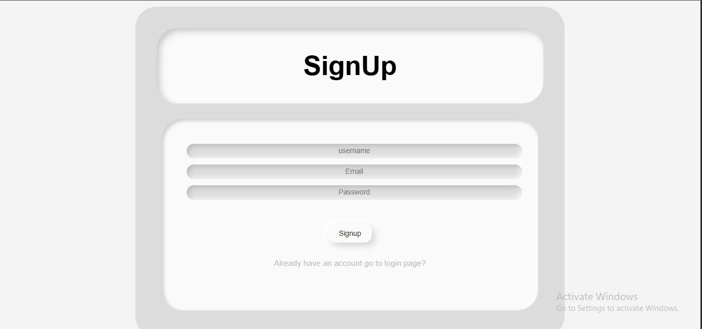
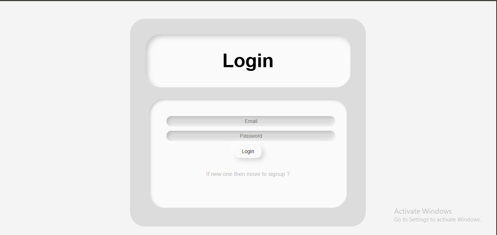
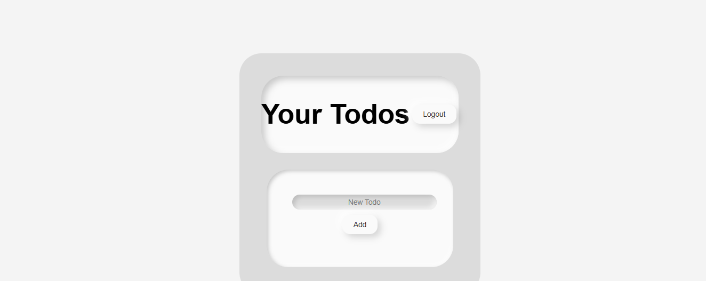

# 📝 Full Stack Todo App (MERN + JWT Authentication)

A complete **MERN stack** Todo Application featuring **user authentication** with **JWT (JSON Web Token)**, **secure APIs**, and a clean **React frontend**.  
Users can **sign up**, **log in**, and **manage their todos** (add, edit, delete, and mark as complete).

---

## 🚀 Tech Stack

**Frontend:** React.js  
**Backend:** Node.js + Express.js  
**Database:** MongoDB (Mongoose)  
**Authentication:** JWT (JSON Web Token)  
**Styling:** CSS / Tailwind (optional)  

---

## 📸 Screenshots

### 🔐 Signup Page


### 🔑 Login Page


### ✅ Todo App Dashboard


---

## ⚙️ Features

- 🔒 Secure User Authentication using JWT  
- 🧠 Password Hashing with bcrypt  
- 🗂️ Create, Read, Update, Delete (CRUD) Todos  
- 🧾 User-specific Todo Management  
- 🌐 RESTful API with Express  
- 💾 MongoDB Database Integration  
- 📱 Responsive UI  

---

## 🛠️ Installation & Setup

### 1. Clone the Repository
```bash
git clone https://github.com/your-username/mern-todo-app.git
cd mern-todo-app
```

### 2. Install Dependencies

**Backend**
```bash
cd backend
npm install
```

**Frontend**
```bash
cd ../frontend
npm install
```

### 3. Configure Environment Variables

Create a `.env` file in the **backend** directory with the following keys:

```
PORT=5000
MONGO_URI=your_mongodb_connection_string
JWT_SECRET=your_jwt_secret_key
```

---

## ▶️ Run the App

### Start Backend Server
```bash
cd backend
npm start
```

### Start Frontend
```bash
cd frontend
npm start
```

Your app will be available at:  
👉 **Frontend:** http://localhost:3000  
👉 **Backend API:** http://localhost:5000  

---

## 📦 Folder Structure

```
mern-todo-app/
│
├── backend/
│   ├── server.js
│   ├── routes/
│   ├── models/
│   ├── controllers/
│   └── middleware/
│
├── frontend/
│   ├── src/
│   │   ├── components/
│   │   ├── pages/
│   │   └── App.js
│
└── README.md
```

---

## 🔐 JWT Authentication Flow

1. **User Signup:** User data is saved securely with hashed passwords.  
2. **User Login:** Backend validates credentials and issues a JWT.  
3. **Access Control:** Protected routes require a valid JWT token in the header.  

---

## 🧑‍💻 Author

**Majid Ali**  
MERN Stack Developer  
[GitHub](https://github.com/your-username)

---

## 🌟 License

This project is licensed under the **MIT License** — feel free to use and modify it for your own learning or projects.

---

> “A simple yet powerful MERN app to manage your tasks efficiently and securely.”  
